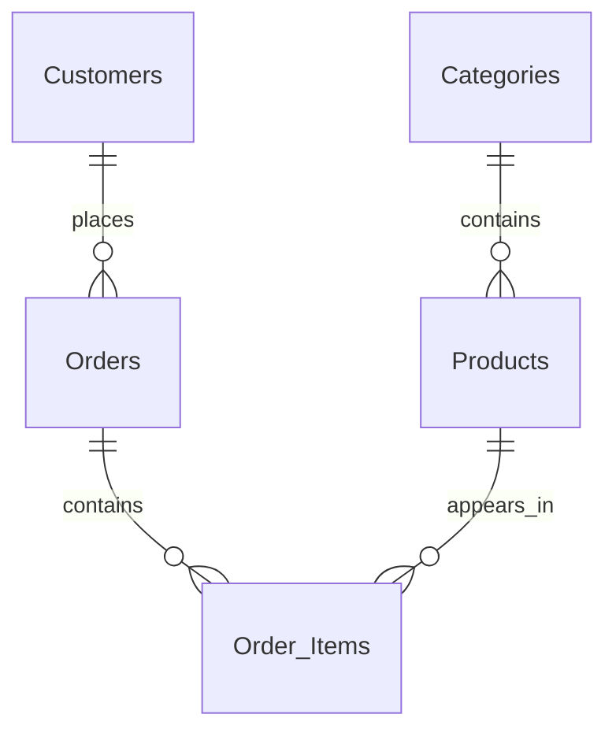

# Relational Database Exercises

I model an online store with categories, products, customers, orders and order items, alongside smaller student, library and healthcare query exercises.

## Technologies

MySQL-compatible SQL.

## Files

- `as1.sql`
- `as2.sql`
- `as3.sql`
- `online-store.sql`

## Run

Use an isolated MySQL-compatible development database. Run `online-store.sql` for the store exercise. Inspect the other exercise scripts before executing them; some depend on tables created elsewhere.

## Scope and limitations

The store script drops and recreates Online_store. Scripts contain educational inserts, updates and deletes, and use fictional examples. Some supplemental queries still require correction or their original schema. They are not migrations for a live application.

## Store relationships

`Order_Items` uses a composite primary key of `order_id` and `pro_id`; the relationship lines correspond to the foreign keys in `online-store.sql`.
